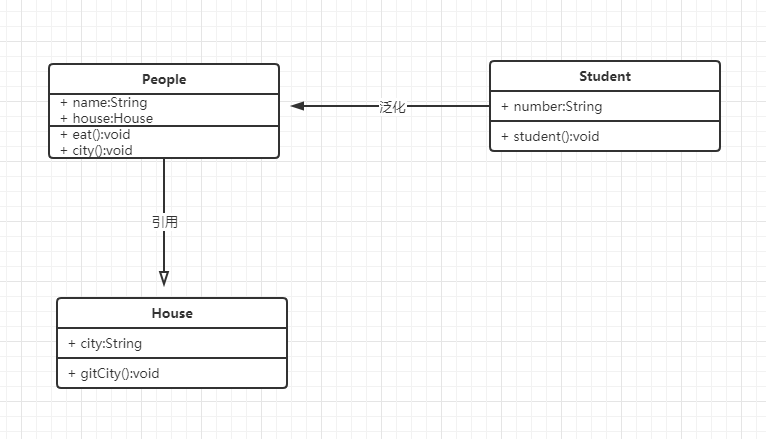

# 面向对象

js是一门弱类型的语言，所以其面向对象只是参考标准的面向对象的逻辑。

## 开发环境的搭建

es6语法并不能完全被浏览器解析，所以我们需要使用webpack等工具将es6转换为浏览器可以解析的es5或者更低级别的语法。

## 什么是面向对象

面向对象中有类和实例的概念。类中有方法和属性，通过new 类可以生成多个实例。

## 面向对象的三要素

面向对象的三个：
- 继承
- 封装
- 多态

## 面向对象的意义

数据结构化
越抽象、越简单

## UML类图

推荐的画图工具
- processon
- ms office visio

UML类图：
- 类
- 关系
  - 泛化（继承）
  - 引用

示例：
