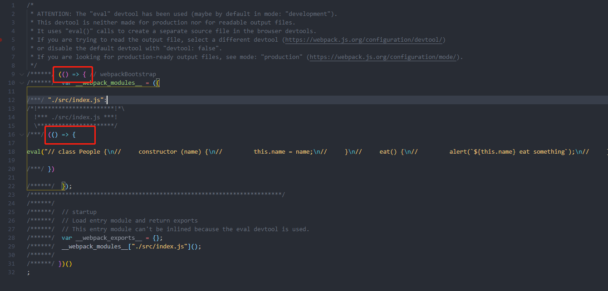
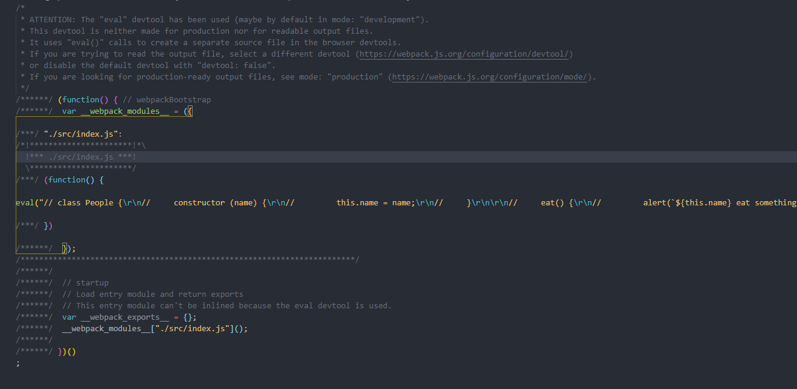

## 搭建开发环境

es6语法并不能完全被浏览器解析，所以我们需要使用webpack等工具将es6转换为浏览器可以解析的es5或者更低级别的语法。下面主要来进行开发环境的搭建开发。


### 初步搭建开发环境
- 安装`npm i webpack webpack-cli --save-dev --registry=https://registry.npm.taobao.org`
    此时如果webpack是5.x版本会有个问题，编译打包后的文件中会含有箭头函数。此时需要添加配置target处理。
    

- 配置`webpack.dev.config.js`文件
    ```js
        module.exports = {
            entry: './src/index.js',
            output: {
                path: __dirname,
                filename: './release/bundle.js'
            },
            target: ['web', 'es5']
        }
    ```

- 配置`package.json`文件，添加dev打包命令`webpack --config webpack.dev.config.js --mode development`
- 执行`npm run dev`。至此一个简单的环境即搭建完成。打包生成的bundle.js此时不含es6语法。
   


### 添加babel解析es6语法
- 安装`npm i babel-loader @babel/core @babel/preset-env --save-dev --registry=https://registry.npm.taobao.org`
- 配置`.babelrc`,该文件在lunix和mac下是隐藏文件，也是执行程序时会自动执行的文件，其任务格式是json
    ```json
        {
            "presets": ["@babel/preset-env"],
            "plugins": []
        }
    ```
- 配置`webpack.dev.config.js`文件
    ```js
        module.exports = {
            entry: './src/index.js',
            output: {
                path: __dirname,
                filename: './release/bundle.js'
            },
            target: ['web', 'es5'],
            module: {
                rules: [{
                    test: /\.js$/,
                    exclude: /(node_modules)/,
                    use: 'babel-loader'
                }]
            }
        }
    ```
- 执行dev打包命令，即可将es6语法转化为es5


### 添加webpack-dev-server和html-webpack-plugin

#### webpack-dev-server是什么
`webpack-dev-server is configured by default to support live-reload of files as you edit your assets while the server is running.`谷歌翻译为`默认情况下，将webpack-dev-server配置为在服务器运行时编辑资产时支持文件的实时重载。`即热部署。
具体使用参考https://github.com/webpack/webpack-dev-server

#### html-webpack-plugin是什么
具体参考：https://webpack.js.org/plugins/html-webpack-plugin/

```js
    plugins: [
        new HtmlWebpackPlugin()
    ]
```
该语句可以自动在根目录下生成index.html，且将打包后的文件引入到html中。使用参考：https://github.com/jantimon/html-webpack-plugin

#### 使用配置
- 安装`npm install webpack-dev-server html-webpack-plugin --save-dev --registry=https://registry.npm.taobao.org`
- 配置`webpack.dev.config.js`
    ```js
        const HtmlWebpackPlugin = require('html-webpack-plugin');
        const path = require('path');

        module.exports = {
            entry: './src/index.js',
            output: {
                path: __dirname,
                filename: './release/bundle.js'
            },
            target: ['web', 'es5'],
            module: {
                rules: [{
                    test: /\.js$/,
                    exclude: /(node_modules)/,
                    use: 'babel-loader'
                }]
            },
            devServer: {
                contentBase: path.join(__dirname, 'release'), // 告诉服务器从何处提供内容，仅当您要提供静态文件时才需要这样做。
                open: true,  // Tells dev-server to open the browser after server had been started
                port: 9000,
            },
            plugins: [
                new HtmlWebpackPlugin({
                    title: 'Custom template',
                    template: 'index.html'
                })
            ]
        }
    ```
- 配置`package.json`文件，修改dev打包命令`webpack serve --config webpack.dev.config.js --mode development`

