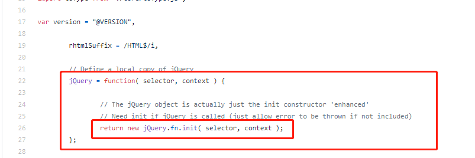

# 面向对象的三要素

## 继承
将一些公共的方法提取出来，通过子继承父类的方式，实现方法的共享，避免代码冗余。

## 封装
实现数据的保护。typescript可以通过public、protected、private进行属性使用范围的设置。
- public：父、子、以及new出的实例中都可以使用 
- protected: 父和子类中可以使用
- private：父中使用

## 多态
同一个接口的不同实现方式。

## 应用举例
jQuery是面向对象,源码截图：

