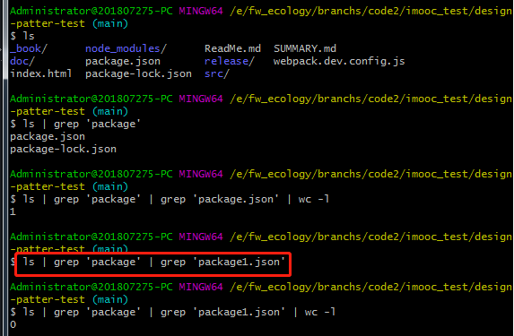

# 第一节：设计

## 描述
- 设计是按照某些原则或者标准实现功能
- 功能相同，可以有不同的设计方案来实现
- 伴随着需求的增加，才能体现出设计的作用（是否便于后续功能扩展等）

## 结合《unix/linux设计哲学》讲解
- 准则1：小即是美
- 准则2：让每个程序只做好一件事件
- 准则3：快速建立原型
- 准则4：舍弃高效率而取可移植性
- 准则5：采用纯文本来存储数据
- 准则6：充分利用软件的杠杆效应（软件复用）
- 准则7：使用shell脚本提高杠杆效应和可移植性
- 准备8：避免强制性的用户界面
- 准则9：让每个程序成为都成为过滤器

#### 小准则
- 允许用户定制环境（允许用户配置）
- 尽量使操作系统内核小而轻量化（分离、解耦）
- 使用小写字母并尽量简短
- 沉默是金
- 各部分之和大于整体
- 寻求90%的解决方案

## 验证

