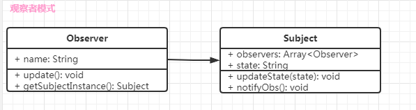
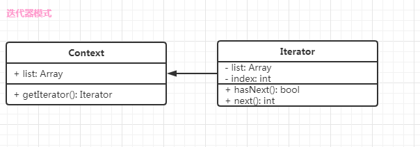
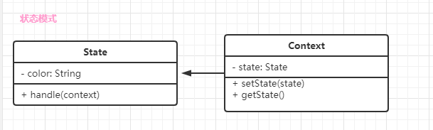
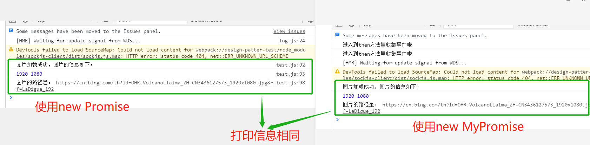

# 第三节：行为型

## 1. 观察者模式
- 描述
发布&订阅、一对N

- 生活场景
 1. 订牛奶
 2. 订报纸

- UML类图




- 代码演示


```js
// 类 Subject
class Subject {
    constructor() {
        this.observers = [];
        this.state = 0;
    }

    // 更新状态
    updateState(state) {
        this.state = state;
        this.notifyObjs();
    }

    // 通知观察者状态发生变化
    notifyObjs() {
        this.observers.forEach(ob => {
            ob.update();
        })
    }

    // 添加观察者
    registryObserver(ob) {
        this.observers.push(ob);
    }
}

// 观察者 Observer
class Observer {
    constructor(name, subject) {
        this.name = name;
        this.subject = subject;
    }

    update() {
        console.log(`${this.name} 状态发生了变化: ${this.subject.state}`);
    }

    getSubjectInstance() {
        this.subject.registryObserver(this);
    }
}

// 测试用例
// 创建一个 subject 实例
const subject = new Subject();

// 注册一个观察者
const ob1 = new Observer('o1', subject);
ob1.getSubjectInstance();
const ob2 = new Observer('o2', subject);
ob2.getSubjectInstance();
const ob3 = new Observer('o3', subject);
ob3.getSubjectInstance();

// 通知 observers，subject 中的 state 发生变化
subject.updateState('23');
subject.updateState('2');
subject.updateState('26');
```

- 应用场景
观察者模式的应用场景是最多的，如果23种设计模式，只选择一种，则一定是观察者模式。
1. 网页的点击等事件
2. jquery的Callbak事件


```html
<!DOCTYPE html>
<html lang="en">
<head>
    <meta charset="UTF-8">
    <meta name="viewport" content="width=device-width, initial-scale=1.0">
    <title>jquery Callback</title>
    <script src="https://cdn.bootcdn.net/ajax/libs/jquery/3.5.1/jquery.js"></script>
</head>
<body>
    <p>使用 jquery.Callback 的方法</p>
    <ul>
        <li>
            <p> 1. 引入 jquery 包 </p>
        </li>
        <li>
            <p> 2. 实例化 jquery.Callbacks </p>
        </li>
        <li>
            <p> 3. 通过 callback.add 添加 observer </p>
        </li>
        <li>
            <p> 4. 通过 callback.fire() 触发状态的改变以及 observer 对应的操作 </p>
        </li>
    </ul>

    <script>
        // 实例化 callback
        var callback = jQuery.Callbacks();

        // 添加 observer
        callback.add(function(info) {
            console.log(`第一个：${info}`);
        })

        callback.add(function(info) {
            console.log(`第二个: ${info}`);
        })

        callback.add(function(info) {
            console.log(`第三个: ${info}`);
        })

        // subject 发生变化，触发 observer
        callback.fire('a1');
        callback.fire('a2'); 

    </script>
</body>
</html>
```

1. nodejs的自定义事件`require('events').EventEmitter`


```js
// 演示 nodejs 中的自定义事件
// 演示 nodejs 中的自定义事件
const EventEmitter  = require('events').EventEmitter;

const eventEmitter = new EventEmitter();

// 通过 EventEmitter.on 注册监听
eventEmitter.on('click', function(info) {
    console.log(`第一个：${info}`)
})

eventEmitter.on('click', function(info) {
    console.log(`第2个：${info}`)
})

eventEmitter.on('click', function(info) {
    console.log(`第3个：${info}`)
})

eventEmitter.on('change', function(info) {
    console.log(`第一个：${info}`)
})

eventEmitter.on('change', function(info) {
    console.log(`第2个：${info}`)
})

eventEmitter.on('change', function(info) {
    console.log(`第3个：${info}`)
})

eventEmitter.emit('click', '点击事件');
eventEmitter.emit('change', '值变化事件')


// 类的继承
class Dog extends EventEmitter {
    constructor(name) {
        super();
        this.name = name;
    }

    wang() {
        console.log(`${this.name}汪汪汪`);
    }
}

const xiaohei = new Dog('xiaohei');
xiaohei.on('hasPeople', xiaohei.wang);
xiaohei.emit('hasPeople');
```

## 2. 迭代器模式
- 描述


顺序访问一个集合(集成必须是有序的，例如对象就不可以。数组就符合规则)

- UML类图



- 代码演示

```js
//  迭代器模式 iterator

// 使用类
class Context {
    constructor(list) {
        this.list = list;
    }

    getIterator() {
        return new MyIterator(this);
    }
}

// 迭代器
class MyIterator {
    constructor(context) {
        this.list = context.list;
        this.index = 0;
    }

    // 是否有下一个
    hasNext() {
        if(this.list.length <= this.index) {
            return false;
        }
        return true;
    }

    // next
    next() {
        if(this.hasNext()) {
            return this.list[this.index++];
        }
    }
}

// 测试用例
const arr = [1, 2, 3, 4, 5];
const context = new Context(arr);
const iterator = context.getIterator();

while(iterator.hasNext()) {
    console.log(iterator.next());
}

```

- 应用场景
 1. jquery的each
 2. es6的iterator以及for...of..

  - 为何存在
    - es6中访问有序集合最简单的方法
    - es6语法中，有序数据集合的类型已经有很多

  - 使用iterator注意事项：
    - 集合必须有`[Symbol.iterator]`属性,属性值是个函数
    - 通过`Symbol.iterator`函数创建出一个iterator实例，指向当前数据结构的起始位置（UML类图即是参考该条进行设计的）
    - 通过`iterator.next()`指向下一个位置，该方法会返回一个obj对象，包含当前位置数据的value和是否遍历结束的标识done
    - 如果done为true，则代表遍历结束

```js
//  es6 语法中的迭代器 iterator

function each(data) {
    
    // const iterator = data[Symbol.iterator]();

    // let item = {done: false};
    // while(!item.done) {
    //     item = iterator.next();
    //     if(!item.done) {
    //         console.log(item.value);
    //     }
    // }

    // 带有 Symbol.iterator 属性的对象才可以使用 for...of...
    for(let item of data) {
        console.log(item);
    }

    // console.log(iterator.next());
    // console.log(iterator.next());
    // console.log(iterator.next());
    // console.log(iterator.next());
    // console.log(iterator.next());
    // console.log(iterator.next());
    // console.log(iterator.next());
}

const arr = [1, 2, 3, 4, 5, 6];
const nodeListArrs = document.getElementsByTagName('p');
const m = new Map();
m.set('a', 100);
m.set('b', 200);

each(arr);
each(nodeListArrs);
each(m);
```


- 设计原则的验证

 1. 迭代器对象和目标对象分离
 2. 迭代器将使用者和目标对象隔离开

## 3. 状态模式
- 描述

    一个对象有多个状态，每个状态的改变都会触发一个逻辑

- 生活中的应用

    红绿灯等

- UML类图

    状态的切换是状态实例上的，状态实例的获取是主题上的。
    

- 代码演示

    ```js
        // 状态类
    class State {
        constructor(color) {
            this.color = color;
        }

        handle(context) {
            console.log(`切换到${this.color}`);
            context.setState(this);
        }
    }

    // 主题类
    class Context {
        constructor() {
            this.state = null;
        }

        setState(state) {
            this.state = state;
        }

        getState() {
            return this.state;
        }
    }

    // 创建多个状态
    const green = new State('绿色');
    const yellow = new State('黄色');
    const red = new State('红色');

    // 创建主题
    const context = new Context();

    // 状态切换时调用的函数
    green.handle(context);
    // 通过主题获取当前的状态
    console.log(context.getState());
    yellow.handle(context);
    console.log(context.getState());
    red.handle(context);
    console.log(context.getState());
    ```
- 应用场景

    1. 有效状态机：`javascript-state-machine`

        ```js
            // javascript-state-machine
            import StateMachine from 'javascript-state-machine';
            import $ from 'jquery';

            let fsm = new StateMachine({
                init: '收藏',
                transitions: [{
                    name: 'deleteStore',
                    from: '取消收藏',
                    to: '收藏'
                }, {
                    name: 'doStore',
                    from: '收藏',
                    to: '取消收藏'
                }],
                methods: {
                    onDoStore: function(obj) {
                        console.log(`当前状态是：${obj.from}, 收藏成功`);
                        updateText();
                    },
                    onDeleteStore: function(obj) {
                        console.log(`当前状态是: ${obj.from}, 取消收藏成功`);
                        updateText();
                    }
                }
            })

            const $btn = $('#btn1');

            function updateText() {
                $btn.text(fsm.state);
            }

            $btn.click(function() {
                if(fsm.is('收藏')) {
                    fsm.doStore();
                } else {
                    fsm.deleteStore();
                }
            })

            updateText();
        ```
    2. Promise
        ```js
            import StateMachine from 'javascript-state-machine';

            // Promise 的有限状态机
            const fsm = new StateMachine({
                init: 'pending',
                transitions: [{
                    name: 'resolve',
                    from: 'pending',
                    to: 'fulfilled',
                }, {
                    name: 'reject',
                    from: 'pending',
                    to: 'rejected',
                }],
                methods: {
                    onResolve: function(state, data, args) {
                        // 处理 resolve 的逻辑, state 是状态机 new 出来的实例，data 是在使用时外部传递的参数
                        
                        data.successLists.forEach(fn => {
                            args = fn(args);
                        });
                    },
                    onReject: function(state, data, args) {
                        // 处理 reject 的逻辑
                        data.failLists.forEach(fn => {
                            args = fn(args);
                        });
                    }
                } 
            });

            // Promise 类
            class MyPromise {
                constructor(fn) {
                    // .then 并不是立即执行，是在 promise 实例返回执行结果后再执行的内容
                    this.successLists = [];
                    this.failLists = [];

                    // fn 是要执行的，执行结束，根据结果返回 resolve 或者 reject 中的内容
                    fn((args) => {
                        // 从 pending 到 fulfilled
                        fsm.resolve(this, args);
                    }, (args) => {
                        // 从 pending 到 rejected
                        fsm.reject(this, args);

                    });
                }

                then(successFn, failFn) {
                    console.log('进入到then方法里收集事件啦');
                    if(successFn) {
                        this.successLists.push(successFn);
                    }
                    if(failFn) {
                        this.failLists.push(failFn);
                    }
                    return this;
                }
            }

            // 测试用例
            let result = new MyPromise(function(resolve, reject) {
                let img = document.createElement('img');
                img.src = 'https://cn.bing.com/th?id=OHR.VolcanoLlaima_ZH-CN3436127573_1920x1080.jpg&rf=LaDigue_192';
                img.onload = function() {
                    resolve(img);
                }
                img.onerror = function() {
                    reject(img);
                }
            });

            result
                .then(function(img) {
                    console.log('图片加载成功，图片的信息如下：');
                    console.log(img.width, img.height);
                    return img;
                }, function(img) {
                    console.log(`图片加载失败，图片路径为${img.src}`);
                })
                .then(function(img) {
                    console.log('图片的路径是：', img.src);
                });
        ```
    浏览器执行效果：
    

