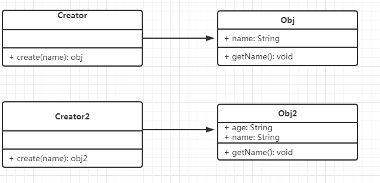

# 第一节: 创建型

创建出对象的方式

## 1. 工厂模式

### 介绍
工厂模式是将new操作单独封装。通过new 类的方式创建对象，可以考虑使用工厂模式。

### UML类图


### 代码演示
```js
    class Product {
        constructor(name) {
            this.name = name;
        }

        getName() {
            alert(this.name);
        }
    }

    // 工厂
    class Creator {
        create(name) {
            return new Product(name); 
        }
    }

    // 测试：
    let creator = new Creator();
    let xiaofujun = creator.create('xiaofujun');
    xiaofujun.getName();
```

### 特点
- 方便扩展
- 对外不抛出对象

### 设计原则验证
- 创建者和构造函数分离
- 符合开放封闭原则

### 应用场景
- jquery源码: 使用jquery`$(p)`,而不是`new $(p)`
- React.createElement
- VUE异步组件
  

## 2. 单例模式

### 介绍
- 系统中唯一被使用
- 一个类只有一个实例

### UML类图
单例模式的UML类图实际要用到java中private属性。js中要用到类的静态方法，即无论new出多少个实例，静态方法永远是那一个。

### 代码演示
1. 通过添加类的静态方法+闭包实现
   ```js
        // 验证单例模式
        class ShoppingCar {
            constructor(counts) {
                this.counts = counts;
            }

            showCounts() {
                alert(this.counts);
            }
        }

        // 通过在类上添加静态方法，结合闭包，初步实现单例
        ShoppingCar.getInstance = (function() {
            let instance;

            return function(counts) {
                if(!instance) {
                    instance = new ShoppingCar(counts);
                }
            
                return instance;
            }
        })(); 

        // 测试
        let obj1 = ShoppingCar.getInstance('1');
        obj1.showCounts(); // 1

        let obj2 = ShoppingCar.getInstance('3');
        obj2.showCounts(); // 1

        console.log('obj1 === obj2', obj1 === obj2);  // true
   ```

### 设计原则验证
- 单一职责原则

### 应用场景
- jquery只有一个$
- 一个系统中只有一个登录框
- vue和redux中的store

## 3. 原型模式

### 介绍
根据已有对象克隆出新对象

### 应用
1. js中的Object.create()函数