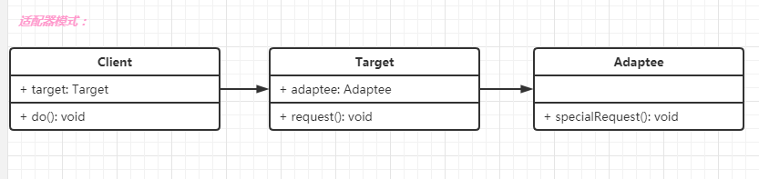
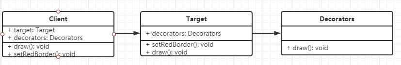
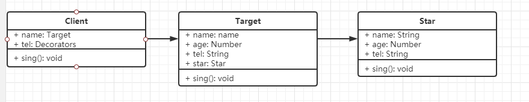

# 第二节: 结构型

## 1. 适配器模式
- 描述
旧接口格式和使用者不兼容，可以通过添加适配器转换接口

- 生活举例
充电器的转换头等

- UML类图


- 代码演示
```js
    // 旧数据格式的接口
    class Adaptee {
        specialRequest() {
            return `typec`;
        }
    }

    // 适配器
    class Target {
        constructor() {
            this.adaptee = new Adaptee();  // 这里不用传参的方式构建实例的原因：原本的类已经不满足新的需求，所以没有必要抛到外面被使用。
        }

        request() {
            let msg = this.adaptee.specialRequest();
            return `USB充电器插头支持${msg}`;
        }
    }

    // 测试用例
    let target = new Target();;
    console.log(target.request());
```
- 应用场景
1. 封装旧接口
2. vue的computed


## 2. 装饰器模式
- 描述
为实例或者类添加新功能，但不改变其原有的结构和功能

- 生活举例
手机壳

- UML类图


- 代码演示
```js
    // 画图工具
    class Circle {
        draw() {
            console.log('画个图形');
        }
    }

    // 装饰器
    class Target {
        constructor(circle) {
            this.circle = circle;  // 这里不使用new Circle的原因：因为原本的类还是可以使用的，所以原本的类可以抛到外面供用户创建实例
        }

        draw() {
            this.circle.draw();
            this.setRedBorder();
        }

        setRedBorder() {
            console.log('设置红色边框');
        }
    }

    // 测试代码
    const circle = new Circle();
    circle.draw();
    const target = new Target(circle);
    target.draw(); 
```

- 应用场景
1. es7 装饰器：配合插件`@babel/plugin-proposal-decorators`


```js
@addTargetName
class Circle {
    @log
    draw() {
        console.log('画个图形');
    }
}

function addTargetName(traget) {
    traget.prototype.enable = 'xfj';  // 实例上添加
    traget.enable1 = 'xfj1'; // 类对象上添加
}

function log(target, name, decorators) {
    const oldValue = decorators.value;

    decorators.value = function() {
        console.log(`你在使用Circle类中的${name}方法`);
        oldValue.apply(this, arguments);
    }
}

// 测试
let circle = new Circle();
console.log(circle.enable); // 'xfj'
console.log(circle.enable1); // undefined
circle.draw(); // 你在使用Circle中的draw方法； 画个圆形
console.log(Circle.enable1); // 'xfj1'
console.log(Circle.enable); // undefined
```

1. [core-decorators](https://www.npmjs.com/package/core-decorators)
使用时`.babelrc`的配置信息：
```json
{
    "presets": ["@babel/preset-env"],
    "plugins": [
        ["@babel/plugin-proposal-decorators", { "legacy": true }]
    ]
}
```

- 和适配器的区别
原本的类或者对象还可以使用，只是要添加新的功能。


## 3. 代理模式
- 描述
用户因为权限、安全等原因无法访问目标对象，通过添加代理实现访问。

- 生活举例
明星经纪人

- UML类图


- 代码演示


```js
const star = {
    name: 'xfj',
    age: 24,
    tel: 'star: 130xxxx8888'
};

let obj = new Proxy(star, {
    get: function(target, key) {
        if('tel' === key) {
            return 'proxy: 189xxxx7618'
        } else if('money' === key) {
            return 120000;
        } else {
            return target[key];
        }
    },
    set: function(target, key, value) {
        if('subPrice' === key) {
            if(value < 100000) {
                throw new Error('价格太低')
            }else {
                target['money'] = value;
            }
        }
    }
})

console.log(obj.name)
console.log(obj.age)
console.log(obj.tel)
obj.subPrice = 110000;
console.log(obj.money);
```

- 应用场景
1. 网页的事件代理（事件委托）
2. jquery的$.proxy
3. es6的proxy

## 4. 外观模式
- 描述
为一组接口提供一个高级接口供用户使用
不符合单一职责原则和开放封闭原则，以及接口独立原则。需要谨慎使用，不可滥用。
