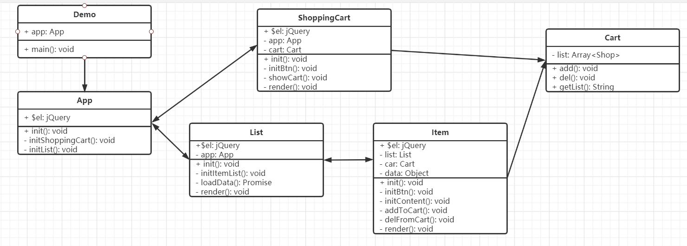

该目录下文件主要分两部分：
1. 设计模式的demo
2. 设计模式的综合示例购物车demo

    - 总结demo中主要用到的几个设计模式：
        - 单例模式
        - 工厂模式
        - 装饰器模式
        - 观察者模式
        - 状态模式
        - 代理模式
        - 模板方法模式

    - 类：
        
    - UML类图：
        
3. 总结
    - 基础知识准备
        - 面向对象和UML类图
        - 五大设计原则SOLID
        - 从设计到模式
    - 常用的设计模式
        - 工厂模式
        - 单例模式
        - 适配器模式
        - 装饰器模式
        - 代理模式
        - 外观模式
        - 观察者模式
        - 迭代器模式
        - 状态模式
    - 其他设计模式
        - 原型模式
        - 享元模式
        - 桥接模式
        - ...
    - 综合应用

        用jquery实现购物车
        业务不复杂，可以不考虑使用设计模式。
