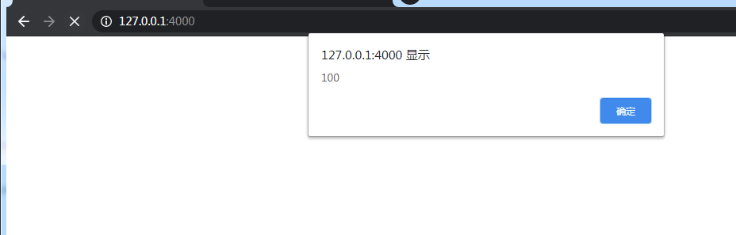

# 示例一

```html
    <!DOCTYPE html>
    <html lang="en">
    <head>
        <meta charset="UTF-8">
        <meta name="viewport" content="width=device-width, initial-scale=1.0">
        <title>Document</title>
    </head>
    <body>
        <h1>首页</h1>

        <script src="./release/bundle.js"></script>

        <script>
            var fastCache = new FastCache();

            // 设置
            fastCache.set('a', 100);

            // 读取
            var cacheA = fastCache.get('a');
            alert(cacheA)
        </script>
    </body>
    </html>
```

效果如下

