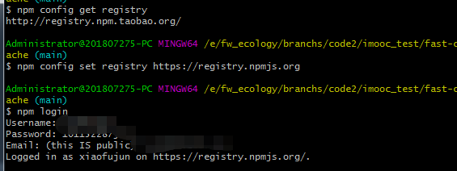

# 1. 准备工作

- 官网下载安装node
- 有条件可以下载git工具

# git的一些基本操作命令
1. git status
2. git diff
3. git add .
4. git commit -m '更新的信息'
5. git push origin master
6. git tag -a 'v0.0.1' -m '第一个版本'
7. git push origin v.0.0.1
   步骤6和7是创建下载的链接

# 发布到npm
最后要提交到npm上，能让使用者通过npm进行安装。

- `npm adduser`
    通过命令行进行npm注册账号并登录

- `npm login`
    npm官网已经注册过账号，直接登录
    

- `npm publish .`
    发布包
    

- `npm unpublish fast-cache-xiaofujun --force`
    撤销发布：`--force`表示强制撤销
    

### 注意事项：
在登录npm官网时，要注意npm的registry是否正确，否则无法成功登录。
- 查看registry: `npm config get registry`
- 设置registry: `npm config set registry http://registry.npmjs.org/` 

### 访问下载
- cdn： https://cdn.jsdelivr.net/npm/fast-cache-xiaofujun/release/bundle.js
    
- npm:  npm install fast-cache-xiaofujun

# 使用cdn
cdn会自动使用最新的版本

# git分支
至少需要两个分支

# package.json中的配置
1. version: 规范版本号。设置为0.0.1；1开头的一般代表是发布的，0开头代表开发版本。
    版本号分为3级：
    一级，重构版本
    二级，重大功能改进
    三级，小升级或者bug修复

2. 规范一级目录
    src---源码
    release---发布结果（build）
    test--- 测试用例
    doc----文档
    example---示例demo

3. webpack构建工具
    将es6语法解析成浏览器可识别的js语法。
    .babelrc
    webpack.config.js
    webpack解析打包文件是通过【webpack】命令执行的

4. 写文档&写测试用例
    1. npm i gitbook-cli -g
    2. SUMMARY.md，具体目录查看截图
    3. gitbook init 将SUMMARY.md中使用到的不存在的目录创建出来
    4. gitbook build 将SUMMARY.md转换为html格式，转换后的html存放在_book文件夹下

# 注意事项（升级）
- 拉取新的分支，修改提交
    1. git checkout -b dev： 创建dev分支
    2. git branch： 查看当前使用的分支
    3. git push origin dev: 将dev分支提交到远程
- 每次升级都需要更改package.json文件中的版本号
- 合并分支，再次创建tag到远程并在npm上发布
    1. 合并分支
        git checkout main: 切换到主干
        git merge dev: 将dev分支的改动合并到主干main
        git push origin main: 提交到远程main
    2. 创建tag
        git tag -a v0.0.2 -m 'v0.0.2': 创建tag
        git push origin v0.0.2: 提交到远程tag
    3. 发布更新npm
        npm publish . : 将最新版本发布到npm 

# 创建官网
通过github pages的配置创建官网。
1. 新建仓库： fast-cache.github.io
2. gitbook build生成的内容提交到fast-cache.github.io